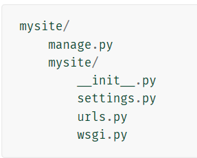
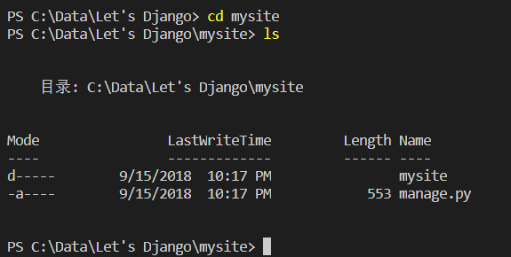
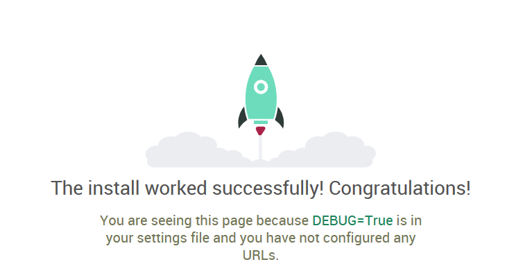

# 第一个Django项目

## 作者:Michael Ji(微信：jibintao)

安装

* 下载并安装Django，使用命令：pip install django，不要使用 PyCharm 或者 其他的IDE中的自动化工具。
  
* 安装结束后在想要建立工程的目录下执行：
  django-admin startproject mysite
* 这时候在目录下会产生如下文件：

  

* 这些是：
  * 'mysite/' 是根目录，包含整个项目的容器，名字可以任意取，和Django本身没有关系。
  * manage.py 用来和Djangol Project来交互的，可以点击[django-admin and manage.py]('https://docs.djangoproject.com/en/2.1/ref/django-admin/')查看ta的详细用法。
  * "\_\_init__.py":  熟悉Python的都知道__init__.py是组成包的一部分，标志着mysite下面是一个Python的包。点击[这里]('https://docs.python.org/3/tutorial/modules.html#tut-packages')会有关于Python包的详细讲解，我们这里就不再赘述。
  * settings.py 是Django Project的配置文件，在setting里面我们将讲解这些设置项如何工作。
  * rls.py 是URL的声明文件。
  * wsgi.py 是WSGI Web server的入口点。

运行

* 知道了这些文件的作用，现在我们来常识运行下这些代码，看看会不会有什么奇迹发生，@_@

* 首先，在命令行中切换当前路径到mysite下面：
* 然后执行命令：python manage.py runserver

  PS C:\Data\Let's Django\mysite> python manage.py runserver

  Performing system checks...

  System check identified no issues (0 silenced).

  You have 15 unapplied migration(s). Your project may not work properly until you apply the migrations for app(s): admin, auth, contenttypes, sessions.
  Run 'python manage.py migrate' to apply them.
  September 16, 2018 - 00:13:41
  Django version 2.1.1, using settings 'mysite.settings'
  Starting development server at <http://127.0.0.1:8000/>.
  Quit the server with CTRL-BREAK.
  Error: [WinError 10013] 以一种访问权限不允许的方式做了一个访问套接字的尝试。

* 结果出现上面10013的错误，Google一下，这个错误是因为Server（此例中就是本机）上8000的端口已经被占用了。怎么办呢？ 两种方法，一，扎到占用8000端口的进程，杀之！ 二，避开这个端口。为了省事，我们随便选另外一个端口运行。
* 再次执行runserver时加上端口好：python manage.py runserver 53421.
* 如果出现下面内容，就说明我们的server已经成功运行起来了。
  
  Starting development server at <http://127.0.0.1:53421/>.

  Quit the server with CTRL-BREAK.

* 最后在浏览器中输入：<http://127.0.0.1:53421/>，再按回车.
  
* 如果绿色小火煎出来了，恭喜您！您第一个Python Web 网站完成了！是不是应该写个Hello World之类的？ -_-