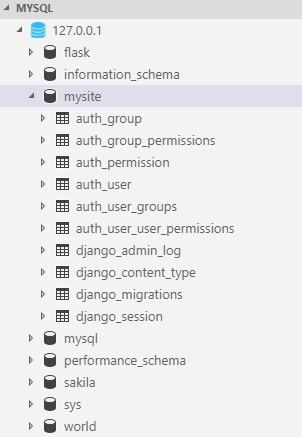

# 创建第一个模型

## 作者:Michael Ji(微信：jibintao)

接着上一小节，我们继续完善投票系统的开发，这节我们将建立一个数据库，注重关注Django提供的自动生成管理页面，这个是Flask所不具备的。

### 数据库配置

第一节中我们讲过Django的项目设置模块是mysite/settings.py文件。通常，这个配置文件使用 SQLite 作为默认数据库。如果你不熟悉数据库，或者只是想尝试下 Django，这是最简单的选择。Python 内置 SQLite，所以你无需安装额外东西来使用它。当你开始一个真正的项目时，你可能更倾向使用一个更具扩展性的数据库，例如 PostgreSQL，避免中途切换数据库这个令人头疼的问题。我们选择MySQL作为数据库引擎，首先需要安装MySQL和它的Python的binding - __mysqlclient__,但是在安装过程中报错，那就只好将它下载到本地再安装，这里我把下载的连接分享出来[点击下载 mysqlclient](https://www.lfd.uci.edu/~gohlke/pythonlibs/#mysqlclient)， 然后再执行命令：pip install .\mysqlclient-1.3.13-cp36-cp36m-win_amd64.whl，这时将显示安装成功。

接下来改变设置文件中 DATABASES 'default' 项目中的一些键值：

*  ENGINE - 也就是数据库引擎，将其有默认的sqlite修改为MySQL。
*  如果不是sqlite，需要添加数据库的其他配置，如下例子：
  
        DATABASES = {
            'default': {
                'ENGINE': 'django.db.backends.mysql',
                'NAME': 'mysite',
                'USER': 'root',
                'PASSWORD': 'xxxxxx',
                'HOST': '127.0.0.1',
                'PORT': '3306',
            }
        }

* 修改时区，默认是UTC，我们改为：TIME_ZONE = 'Asia/Shanghai'，时区列表可以从[维基百科](https://en.wikipedia.org/wiki/List_of_tz_database_time_zones)上查找.

* 在文件头部的 INSTALLED_APPS 设置项里包括了会在你项目中启用的所有 Django 应用。应用能在多个项目中使用，你也可以打包并且发布应用，让别人使用它们。通常， INSTALLED_APPS 默认包括了以下 Django 的自带应用：
    * django.contrib.admin -- 管理员站点， 你很快就会使用它。
    * django.contrib.auth -- 认证授权系统。
    * django.contrib.contenttypes -- 内容类型框架。
    * django.contrib.sessions -- 会话框架。
    * django.contrib.messages -- 消息框架。
    * django.contrib.staticfiles -- 管理静态文件的框架。
  
这些应用被默认启用是为了给常规项目提供方便。默认开启的某些应用需要至少一个数据表，所以，在使用他们之前需要在数据库中创建一些表。请执行以下命令：
> python manage.py migrate

migrate 命令检查 INSTALLED_APPS 设置，为其中的每个应用创建需要的数据表，至于具体会创建什么，这取决于你的 mysite/settings.py 设置文件和每个应用的数据库迁移文件（我们稍后会介绍这个）。这个命令所执行的每个迁移操作都会在终端中显示出来。

PS,请在migrate之前确保MySQL中已经创建了NAME为'mysite'的数据库！如果没有，请在MySQL的命令行中执行：
> create database mysite;

在migrate之后，运行你数据库的命令行工具，并输入 SHOW TABLES; 来看看 Django 到底创建了哪些表(我使用的是VS code的MySQL插件)。您将会看到下图：

看到些表，说明我们设置连接数据库已经完成。

### 创建模型