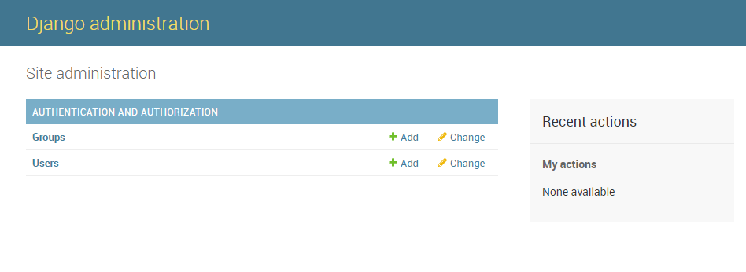
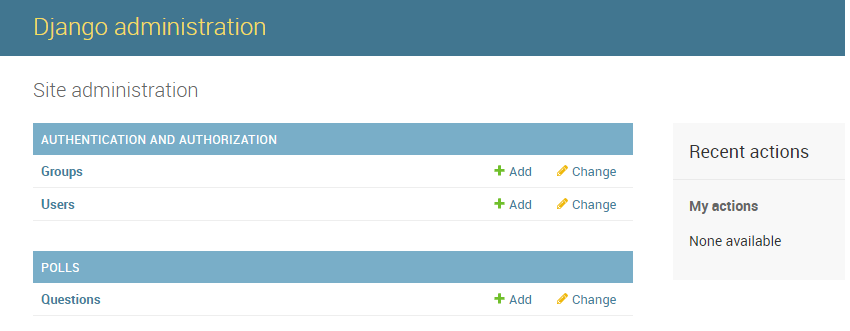

# 创建第一个模型

__作者:Michael Ji(微信：jibintao)__

接着上一小节，我们继续完善投票系统的开发，这节我们将建立一个数据库，注重关注Django提供的自动生成管理页面，这个是Flask所不具备的。

## 数据库配置

第一节中我们讲过Django的项目设置模块是mysite/settings.py文件。通常，这个配置文件使用 SQLite 作为默认数据库。如果你不熟悉数据库，或者只是想尝试下 Django，这是最简单的选择。Python 内置 SQLite，所以你无需安装额外东西来使用它。当你开始一个真正的项目时，你可能更倾向使用一个更具扩展性的数据库，例如 PostgreSQL，避免中途切换数据库这个令人头疼的问题。我们选择MySQL作为数据库引擎，首先需要安装MySQL和它的Python的binding - __mysqlclient__,但是在安装过程中报错，那就只好将它下载到本地再安装，这里我把下载的连接分享出来[点击下载 mysqlclient](https://www.lfd.uci.edu/~gohlke/pythonlibs/#mysqlclient)， 然后再执行命令：pip install .\mysqlclient-1.3.13-cp36-cp36m-win_amd64.whl，这时将显示安装成功。

接下来改变设置文件中 DATABASES 'default' 项目中的一些键值：

*  ENGINE - 也就是数据库引擎，将其有默认的sqlite修改为MySQL。
*  如果不是sqlite，需要添加数据库的其他配置，如下例子：
  
        DATABASES = {
            'default': {
                'ENGINE': 'django.db.backends.mysql',
                'NAME': 'mysite',
                'USER': 'root',
                'PASSWORD': 'xxxxxx',
                'HOST': '127.0.0.1',
                'PORT': '3306',
            }
        }

* 修改时区，默认是UTC，我们改为：TIME_ZONE = 'Asia/Shanghai'，时区列表可以从[维基百科](https://en.wikipedia.org/wiki/List_of_tz_database_time_zones)上查找.

* 在文件头部的 INSTALLED_APPS 设置项里包括了会在你项目中启用的所有 Django 应用。应用能在多个项目中使用，你也可以打包并且发布应用，让别人使用它们。通常， INSTALLED_APPS 默认包括了以下 Django 的自带应用：
    * django.contrib.admin -- 管理员站点， 你很快就会使用它。
    * django.contrib.auth -- 认证授权系统。
    * django.contrib.contenttypes -- 内容类型框架。
    * django.contrib.sessions -- 会话框架。
    * django.contrib.messages -- 消息框架。
    * django.contrib.staticfiles -- 管理静态文件的框架。
  
这些应用被默认启用是为了给常规项目提供方便。默认开启的某些应用需要至少一个数据表，所以，在使用他们之前需要在数据库中创建一些表。请执行以下命令：
> python manage.py migrate

migrate 命令检查 INSTALLED_APPS 设置，为其中的每个应用创建需要的数据表，至于具体会创建什么，这取决于你的 mysite/settings.py 设置文件和每个应用的数据库迁移文件（我们稍后会介绍这个）。这个命令所执行的每个迁移操作都会在终端中显示出来。

PS,请在migrate之前确保MySQL中已经创建了NAME为'mysite'的数据库！如果没有，请在MySQL的命令行中执行：
> create database mysite;

在migrate之后，运行你数据库的命令行工具，并输入 SHOW TABLES; 来看看 Django 到底创建了哪些表(我使用的是VS code的MySQL插件)。您将会看到下图：

		 	mysql> SHOW TABLES;
		    +----------------------------+
		    | Tables_in_mysite           |
		    +----------------------------+
		    | auth_group                 |
		    | auth_group_permissions     |
		    | auth_permission            |
		    | auth_user                  |
		    | auth_user_groups           |
		    | auth_user_user_permissions |
		    | django_admin_log           |
		    | django_content_type        |
		    | django_migrations          |
		    | django_session             |
		    +----------------------------+
		    10 rows in set (0.01 sec)

看到些表，说明我们设置连接数据库已经完成。

## 创建模型

在 Django 里写一个数据库驱动的 Web 应用的第一步是定义模型 - 也就是数据库结构设计和附加的其它元数据。

在这个简单的投票应用中，需要创建两个模型：问题 Question 和选项 Choice。Question 模型包括问题描述和发布时间。Choice 模型有两个字段，选项描述和当前得票数。每个选项属于一个问题。这些概念可以通过一个简单的 Python 类来描述。按照下面的例子来编辑 polls/models.py 文件：

        from django.db import models

        class Question(models.Model):
            question_text = models.CharField(max_length=200)
            pub_date = models.DateTimeField('date published')

        class Choice(models.Model):
            question = models.ForeignKey(Question, on_delete=models.CASCADE)
            choice_text = models.CharField(max_length=200)
            votes = models.IntegerField(default=0)

每个模型都被表示为 django.db.models.Model 的子类，每个模型都有一些变量，它们都代表模型里一个数据库字段。每个字段都是Field类的实例，比如，字符字段被表示为 CharField，日期字段被表示为DateTimeField。以这种方式告诉 Django每个字段的数据类型是什么。

每个Field类实例变量的名称就是数据库的字段名，比如上面的：question_text和pub_date。定义某些 Field 类实例需要参数。例如 CharField 需要一个 max_length 参数。这个参数的用处不止于用来定义数据库结构，也用于验证数据。Field 也能够接收多个可选参数；在上面的例子中：我们将 votes 的 default 也就是默认值，设为0。

在上例的最后，我们使用 ForeignKey 定义了一个关系。这将告诉 Django，每个 Choice 对象都关联到一个 Question 对象。Django 支持所有常用的数据库关系：多对一、多对多和一对一。

## 激活模型

依据上面的代码定义，Django将在数据库中产生对应的数据库表（schema），在migrate之前别忘记把polls app装入到项目中，这个在前面讲过，是通过在setting下面的INSTALLED_APPS中添加的，在poll的例子中我们应该在INSTALLED_APPS中添加'polls.app.PollsConfig', 因为PollsConfig类是在polls/app.py中。

接下来执行命令：
> python manage.py makemigrations polls

输出的内容如下：

        PS C:\Data\Study\Let-s-Django\mysite> python .\manage.py makemigrations polls
        Migrations for 'polls':
        polls\migrations\0001_initial.py
            - Create model Choice
            - Create model Question
            - Add field question to choice

在执行makemigrations命令是， Django会检测到你对模型文件的修改，并且把 __修改的部分__ 存储为一次migration，这个时候并没有同步到数据库中，而是暂存在硬盘上的一个文件中。我们的例子中是在： polls/migrations/0001_initial.py，其内容如下：

    from django.db import migrations, models
    import django.db.models.deletion

    class Migration(migrations.Migration):

        initial = True

        dependencies = [
        ]

        operations = [
            migrations.CreateModel(
                name='Choice',
                fields=[
                    ('id', models.AutoField(auto_created=True, primary_key=True, serialize=False, verbose_name='ID')),
                    ('choice_text', models.CharField(max_length=200)),
                    ('votes', models.IntegerField(default=0)),
                ],
            ),
            migrations.CreateModel(
                name='Question',
                fields=[
                    ('id', models.AutoField(auto_created=True, primary_key=True, serialize=False, verbose_name='ID')),
                    ('question_text', models.CharField(max_length=200)),
                    ('pub_date', models.DateTimeField(verbose_name='date published')),
                ],
            ),
            migrations.AddField(
                model_name='choice',
                name='question',
                field=models.ForeignKey(on_delete=django.db.models.deletion.CASCADE, to='polls.Question'),
            ),
        ]

是不是就是我们在models.py中定义的内容？

Django也有一个自动 migrate 并同步到数据库中的指令，还有印象吗？ 对就是我们之前配置数据库是使用的 __migrate__ 指令. 在详解 migrate 指令之前，我们先学习 sqlmigrate 指令， sqlmigrate 指令负责将models中的定义，叫描述可能更合适，翻译为 SQL。 OK，我们执行下看看会有什么结果。

> python manage.py sqlmigrate polls 0001

返回：

        BEGIN;
        --
        -- Create model Choice
        --
        CREATE TABLE `polls_choice` (
            `id` integer AUTO_INCREMENT NOT NULL PRIMARY KEY, 
            `choice_text` varchar(200) NOT NULL, 
            `votes` integer NOT NULL
        );
        --
        -- Create model Question
        --
        CREATE TABLE `polls_question` (
            `id` integer AUTO_INCREMENT NOT NULL PRIMARY KEY, 
            `question_text` varchar(200) NOT NULL, 
            `pub_date` datetime(6) NOT NULL
        );
        --
        -- Add field question to choice
        --
        ALTER TABLE `polls_choice` ADD COLUMN `question_id` integer NOT NULL;
        ALTER TABLE `polls_choice` 
            ADD CONSTRAINT `polls_choice_question_id_c5b4b260_fk_polls_question_id` 
                FOREIGN KEY (`question_id`) 
                REFERENCES `polls_question` (`id`);
        COMMIT;

如果之前有学习过数据库，返回的这段SQL 语句应该很容易理解，如果不能很好理解的话，不用担心，后面我们有一个专题，专门介绍MySQL及 SQL。 然后再到MySQL的commandline下执行：
> SHOW TABLES;

这时发现数据库中并没有生产新的表，所以，sqlmigrate 指令仅仅是翻译并显示对应的SQL 语句，以便我们double check。从上面 SQL语句我们可以看出，表名是由app的名称加上models中的类的名称来定义的。

现在轮到migrate指令出场了！请执行下面指令：

> python manage.py migrate

返回：

        Operations to perform:
        Apply all migrations: admin, auth, contenttypes, polls, sessions
        Running migrations:
        Applying polls.0001_initial... OK

再到MySQL中查看。

        mysql> SHOW TABLES;
        +----------------------------+
        | Tables_in_mysite           |
        +----------------------------+
        | auth_group                 |
        | auth_group_permissions     |
        | auth_permission            |
        | auth_user                  |
        | auth_user_groups           |
        | auth_user_user_permissions |
        | django_admin_log           |
        | django_content_type        |
        | django_migrations          |
        | django_session             |
        | polls_choice               |
        | polls_question             |
        +----------------------------+
        12 rows in set (0.01 sec)

哈哈，最后两张表就是我们创建的，却没有写一行SQL语句！

细心的同学可能发现数据库列表里面有一个叫做'django_migrations'的，这个是Django自动创建的，用来跟踪执行过哪些migrations。我们可以查看下它的内容：

        mysql> select * from django_migrations;
        +----+--------------+------------------------------------------+----------------------------+
        | id | app          | name                                     | applied                    |
        +----+--------------+------------------------------------------+----------------------------+
        |  1 | contenttypes | 0001_initial                             | 2018-09-17 04:30:00.161090 |
        |  2 | auth         | 0001_initial                             | 2018-09-17 04:30:01.843989 |
        |  3 | admin        | 0001_initial                             | 2018-09-17 04:30:02.159012 |
        |  4 | admin        | 0002_logentry_remove_auto_add            | 2018-09-17 04:30:02.171046 |
        |  5 | admin        | 0003_logentry_add_action_flag_choices    | 2018-09-17 04:30:02.182577 |
        |  6 | contenttypes | 0002_remove_content_type_name            | 2018-09-17 04:30:02.429530 |
        |  7 | auth         | 0002_alter_permission_name_max_length    | 2018-09-17 04:30:02.688864 |
        |  8 | auth         | 0003_alter_user_email_max_length         | 2018-09-17 04:30:02.720953 |
        |  9 | auth         | 0004_alter_user_username_opts            | 2018-09-17 04:30:02.732983 |
        | 10 | auth         | 0005_alter_user_last_login_null          | 2018-09-17 04:30:02.913475 |
        | 11 | auth         | 0006_require_contenttypes_0002           | 2018-09-17 04:30:02.919492 |
        | 12 | auth         | 0007_alter_validators_add_error_messages | 2018-09-17 04:30:02.931523 |
        | 13 | auth         | 0008_alter_user_username_max_length      | 2018-09-17 04:30:03.100980 |
        | 14 | auth         | 0009_alter_user_last_name_max_length     | 2018-09-17 04:30:03.252387 |
        | 15 | sessions     | 0001_initial                             | 2018-09-17 04:30:03.373558 |
        | 16 | polls        | 0001_initial                             | 2018-09-17 12:33:45.788572 |
        +----+--------------+------------------------------------------+----------------------------+
        16 rows in set (0.00 sec)

我深深感受到migration的强大，它能让你在开发过程中持续的改变数据库结构而不需要重新删除和创建表 - 它专注于使数据库平滑升级而不会丢失数据。我们后面会更加深入的学习这部分内容，现在，只需要记住，改变模型需要这三步：

* 编辑 models.py 文件，改变模型。
* 运行 python manage.py makemigrations 为模型的改变生成迁移文件。
* 运行 python manage.py migrate 来应用数据库迁移。

## 使用API

请在命令行中切换路径到 mysite/ 下， 并执行：
> python manage.py shell

是不是熟悉的味道扑面而来？哈哈，这正是IPython的交互式命令行， 但是和直接运行IPython不一样，是因为 manage.py 会设置 DJANGO_SETTINGS_MODULE 环境变量，这个变量会让 Django 根据 mysite/settings.py 文件来设置 Python 包的导入路径。

我们尝试导入Choice和Question试试：

        In [1]: from polls.models import Choice, Question

        In [2]: Question.objects.all()
        Out[2]: <QuerySet []>

        In [3]:

哈哈，么有任何问题，成功导入，说明 __DJANGO_SETTINGS_MODULE__ 环境变量设置完成。下来尝试创建一个Question的实例，然后看看数据库中是否增加了一条新的记录。

        In [6]: from django.utils import timezone
        In [7]: q = Question(question_text="Whar's new?", pub_date=timezone.now())
        In [8]: q.save()

        In [9]: q.id
        Out[9]: 1

        In [10]: q.question_text
        Out[10]: "Whar's new?"

        In [11]: q.pub_date
        Out[11]: datetime.datetime(2018, 9, 17, 13, 27, 50, 465426, tzinfo=<UTC>)

从IPython的交互环境中查看Question的对象，发现数据已经被存储，但是，MySQL中是不是也已经有数据呢？好办，我们再到MySQL命令行中查询polls_question 表：

        mysql> select * from polls_question;
        +----+---------------+----------------------------+
        | id | question_text | pub_date                   |
        +----+---------------+----------------------------+
        |  1 | Whar's new?   | 2018-09-17 13:27:50.465426 |
        +----+---------------+----------------------------+
        1 row in set (0.00 sec)

OK， 没有问题，MySQL中保存的就是刚刚 q对象的内容。

我们在尝试更新下q对象中的内容试试:

        In [12]: q.question_text = "what's up?"

        In [13]: q.save()

        In [14]: Question.objects.all()
        Out[14]: <QuerySet [<Question: Question object (1)>]>

看看会发生什么？

        mysql> select * from polls_question;
        +----+---------------+----------------------------+
        | id | question_text | pub_date                   |
        +----+---------------+----------------------------+
        |  1 | what's up?    | 2018-09-17 13:27:50.465426 |
        +----+---------------+----------------------------+
        1 row in set (0.00 sec)

这时，polls_question表中的内容已经被更新。 

上面In [14]: Question.objects.all()  中我们查看Question中的所有对象， 在Out[14] 返回<QuerySet [<Question: Question object (1)>]> ，这对于我了解这个对象的细节没有是帮助，如果看过Python cook book，肯定对对象的 \_\_str\_\_() 和 \_\_repr\_\_()方法不陌生。 OK，现在让我们给Question类和Choice类添加\_\_str\_\_() 方法以便来更好的描述它。 现在models.py 将变成下面模样：

        from django.db import models

        # Create your models here.

        class Question(models.Model):
            question_text = models.CharField(max_length=200)
            pub_date = models.DateTimeField('date published')

            # ...
            def __str__(self):
                return self.question_text

        class Choice(models.Model):
            question = models.ForeignKey(Question, on_delete=models.CASCADE)
            choice_text = models.CharField(max_length=200)
            votes = models.IntegerField(default=0)

            # ...
            def __str__(self):
                return self.choice_text

保存文件，在IPython中输出quit(), 按回车键，重新在命令行中执行：
> python manage.py shell

再次执行Question的对象查询：

    In [1]: from polls.models import Choice, Question

    In [2]: Question.objects.all()
    Out[2]: <QuerySet [<Question: what's up?>]>

我们不一样，吼吼！

Django提供了非常丰富的数据库查询API that's entirely driven by keyword arguments.下面列举一些：

* 
        In [3]: Question.objects.filter(id=1)
        Out[3]: <QuerySet [<Question: what's up?>]>

* 
        In [5]: Question.objects.filter(question_text__startswith='what')
        Out[5]: <QuerySet [<Question: what's up?>]>

* 
        In [6]: from django.utils import timezone

        In [7]: current_year = timezone.now().year

        In [8]: Question.objects.get(pub_date__year=current_year)
        Out[8]: <Question: what's up?>

*  
        In [9]: Question.objects.get(id=2)
        ---------------------------------------------------------------------------
        DoesNotExist                              Traceback (most recent call last)
        <ipython-input-9-75091ca84516> in <module>()
        ----> 1 Question.objects.get(id=2)

        C:\Anaconda3\lib\site-packages\django\db\models\manager.py in manager_method(self, *args, **kwargs)
            80         def create_method(name, method):
            81             def manager_method(self, *args, **kwargs):
        ---> 82                 return getattr(self.get_queryset(), name)(*args, **kwargs)
            83             manager_method.__name__ = method.__name__
            84             manager_method.__doc__ = method.__doc__

        C:\Anaconda3\lib\site-packages\django\db\models\query.py in get(self, *args, **kwargs)
            397             raise self.model.DoesNotExist(
            398                 "%s matching query does not exist." %
        --> 399                 self.model._meta.object_name
            400             )
            401         raise self.model.MultipleObjectsReturned(

        DoesNotExist: Question matching query does not exist.

## 介绍 Django 管理页面

为你的员工或客户生成一个用户添加，修改和删除内容的后台是一项缺乏创造性和乏味的工作。因此，Django 全自动地根据模型创建后台界面。

Django 产生于一个公众页面和内容发布者页面完全分离的新闻类站点的开发过程中。站点管理人员使用管理系统来添加新闻、事件和体育时讯等，这些添加的内容被显示在公众页面上。Django 通过为站点管理人员创建统一的内容编辑界面解决了这个问题。

管理界面不是为了网站的访问者，而是为管理者准备的。

### 创建一个管理员账号

首先，我们得创建一个能登录管理页面的用户。请运行下面的命令：
> python manage.py createsuperuser

键入你想要使用的用户名，然后按下回车键：
> Username: admin

然后提示你输入想要使用的邮件地址：
> Email address: admin@example.com

最后一步是输入密码。你会被要求输入两次密码，第二次的目的是为了确认第一次输入的确实是你想要的密码。

> Password: **********
> 
> Password (again): *********
> 
> Superuser created successfully.

然后再 python manage.py runserver 54321， 并在浏览器中 打开<http://127.0.0.1:54321/admin/>, 页面显示登录界面，请输入刚才设置的用户名和密码进入管理界面：

你将会看到几种可编辑的内容：组和用户。它们是由 django.contrib.auth 提供的，这是 Django 开发的认证框架。但是找不到我们polls app？它没在索引页面里显示。

### 向管理页面中加入投票应用

只需要做一件事：我们得告诉管理页面，Question 对象需要被管理。打开 polls/admin.py 文件，把它编辑成下面这样：

        from django.contrib import admin

        from .models import Question

        admin.site.register(Question)

### 体验便捷的管理功能

现在我们向管理页面注册了 Question 类。Django 知道它应该被显示在索引页里：

至此，我们完成了在管理页面中添加Question类， 现在我们可以在管理页来操作Question类的对象了。

Enjoy ^_^